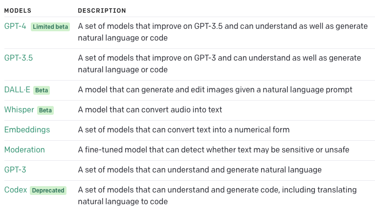
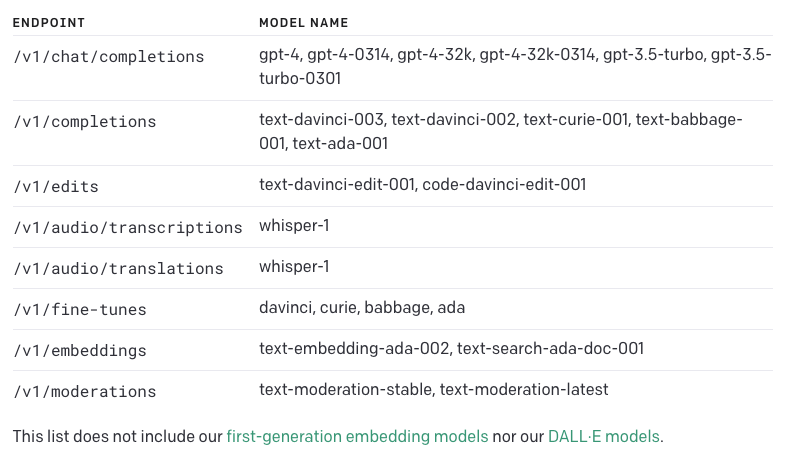

# Models
## Overview
The OpenAI API is powered by a diverse set of models with different capabilities and price points. You can also make limited customizations to the original base models for your specific use case with fine-tuning.

## Models Descriptions

## Model Endpoint Capability

