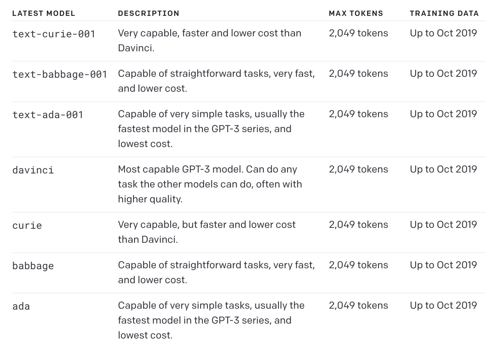

# GPT-3 
models can understand and generate natural language. These models were superceded by the more powerful GPT-3.5 generation models. However, the original GPT-3 base models (davinci, curie, ada, and babbage) are current the only models that are available to fine-tune.

